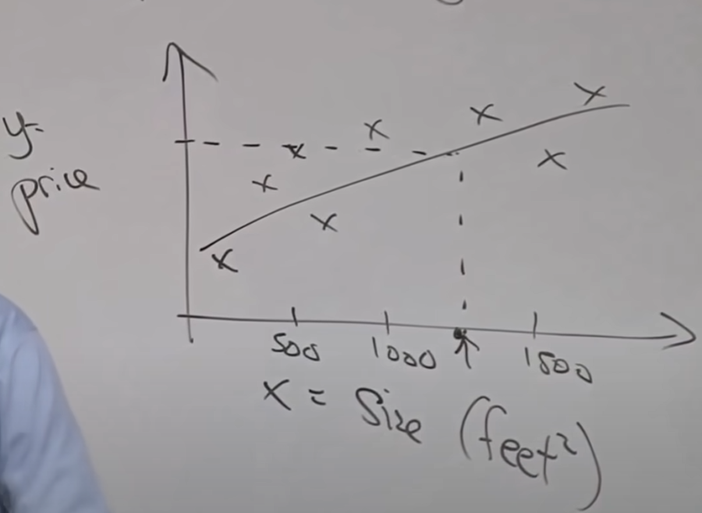
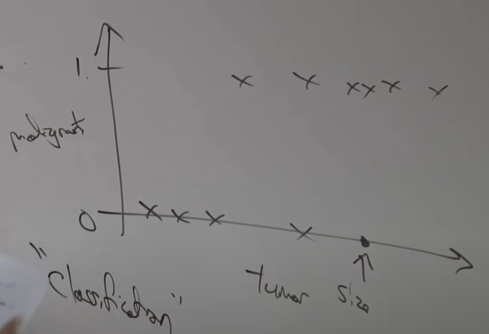
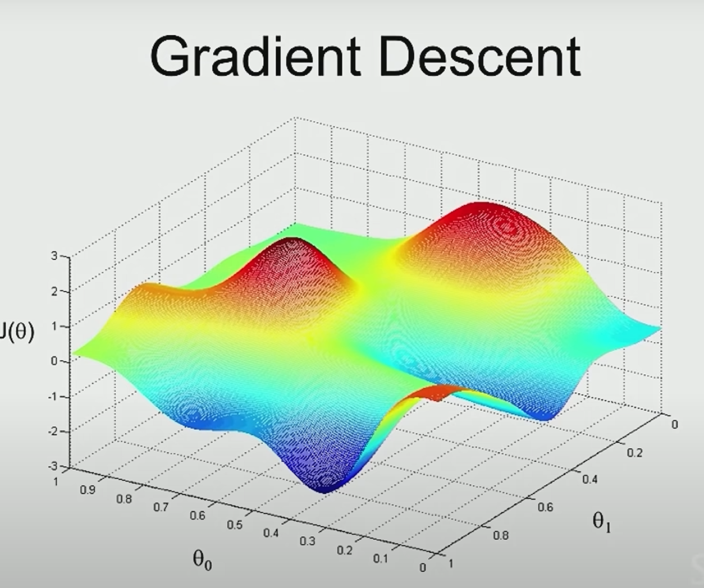
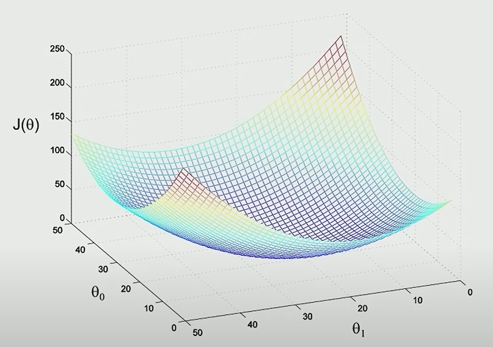

# Lecture 1

## Introduction

1. prerequisite

    1. basic data structure: queue,stack,binary tree
    2. probability and statistics: random variable,expected value of a random variable,variance of a random variable
    3. linear algebra: matrix,vector, how to multiply two matrices and multiplying matrices and a vector and __eigenvector__.
2. homework
3. machine learning is defined as _giving computers the ability to learn wihout being explicitly programmed_

## Supervised Learning

_most widely used machine learning tool_

### Definition

The supervised learning problem is given a dataset with inputs $X$ and labels $Y$ to find the relationship __mapping__ : $X\rightarrow Y$.

### Regression & Classification
Example above is also a __regression problem__ which refers to that the value $Y$ you're trying to predict is __continuous__.

While this tumor case is a __classification problem__ which refers to that $Y$ here takes on a __discrete__ number(only $1$ and $0$) of variables,even if there are $K$ discrete outputs,(like in this case if there are $K = 5$ types of cancer) it'll still be a __classification problem__,since output is __discrete__ anyway.

In most of times inputs can be __multi-dimensional__,we can fit a line that separate out the positive and negative examples(using __logistic algorithm__).While there's an algorithm called the __support vector machine__ that allows you to use an __$\infty$-dimensional__ vector,to represent a data case.

## Machine Learning Strategy

_learning theory_

## Deep Learning

_A subset of machine learning which is advancing rapidly right now._

## Unsupervised Learning

Which gives you a dataset without labels $Y$,only inputs $X$.

$e.g.1$ __Clustering Algorithm__

$e.g.2$ __Independent Components Analysis__ - to solve cocktail party problem

## Reinforcement Learning

Actually there is no standard about what is best or not,so we let the subject(like a robot or pet dog anyway) to do anything and then we human choose to give reward or not.

# Lecture 2

## Supervised Learning

process:dataset $\rightarrow$learning algorithm$\rightarrow$hypothesis function

__$h(x) = \theta_0 + \theta_1x$__

with more input $x$,we can get hypothesis function like $h(x) = \theta_0 + \theta_1x_1 + \theta_2x_2$(in this case $x_1$ is size and $x_2$ is number of rooms)

We can also have __$h(x) = \sum\limits_{j=0}^{2}\theta_jx_j$__,where $x_0 = 1$,$\theta = 
 \left[
 \begin{matrix}
   \theta_0 \\
   \theta_1 \\
   \theta_2
  \end{matrix}
  \right]$,$x = 
 \left[
    \begin{matrix}
    x_0 \\
    x_1 \\
    x_2
   \end{matrix}
 \right]$

$\theta$: parameters

$m$: number of training examples

$x$: inputs/features

$y$: output\target variable

$(x,y)$: training example

$(x^{(i)},y^{(i)})$: $i^{th}$ training example

$n$: number of features(in this case $n = 2$)

## Linear Regression Algorithm
We want to minimize ${(h_{\theta}(x) - y)}^2$,let $J(\theta)=\frac 12\sum\limits_{i=1}^m{(h_{\theta}(x^{(i)}) - y^{(i)})}^2$ and find the best $\theta$ using __Gradient Descent__

First,we start with $\theta = \vec{0}$,keep changing $\theta$ to reduce $J(\theta)$

$\theta_j := \theta_j - \alpha\frac{\partial}{\partial\theta_j}J(\theta)$ (_column equal means assignment_ and $\alpha$ means __learning rate__),by calculus,

$\theta_j := \theta_j - \alpha\sum\limits_{i=1}^m(h_\theta(x^{(i)}) - y^{(i)})x_j^{(i)}$

## Gradient Decent Algorithm
KEY:_repeat until convergence_ 

It may be used in generalized linear models,neural networks and a few other algorithms.

_no local optimal_

### Batch Gradient Algorithm

Its disadavantage occurs in case of big dataset

### Stochastic Gradient Descent

    Repeat{
        For i=1 to m{
$\theta_j :=\theta_j - \alpha (h_\theta(x^{(i)}) - y^{(i)})x_j^{(i)}$

        }
    }
 
 ## Normal Equation

only can be used in __Linear Regression__

$\nabla_\theta J(\theta)(\theta \isin \reals^{n+1}) =
\left[
    \begin{matrix}
    \frac{\partial J}{\partial\theta_0} \\
    \frac{\partial J}{\partial\theta_1} \\
    \frac{\partial J}{\partial\theta_2}
   \end{matrix}
 \right]$

 $e.g$
 $A \isin \reals^{2*2}, A = 
 \left[
    \begin{matrix}
    A_{11} A_{12} \\
    A_{21} A_{22}
    \end{matrix}
\right ],f:\reals^{2*2}\rightarrow\reals$
