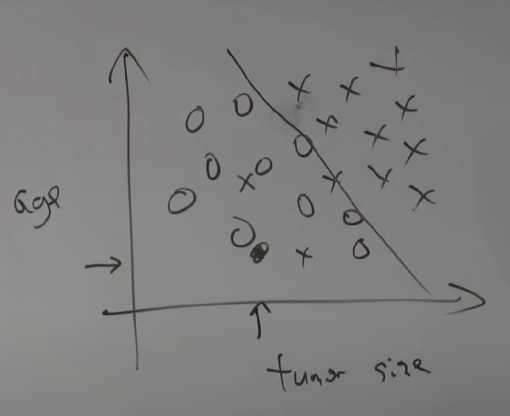

# Lecture 1

## Introduction

1. prerequisite

    1. basic data structure: queue,stack,binary tree
    2. probability and statistics: random variable,expected value of a random variable,variance of a random variable
    3. linear algebra: matrix,vector, how to multiply two matrices and multiplying matrices and a vector and __eigenvector__.
2. homework
3. machine learning is defined as _giving computers the ability to learn wihout being explicitly programmed_

##Supervised Learning

_most widely used machine learning tool_

### Definition

The supervised learning problem is given a dataset with inputs $X$ and labels $Y$ to find the relationship __mapping__ : $X\rightarrow Y$.

### Regression & Classification
Example above is also a __regression problem__ which refers to that the value $Y$ you're trying to predict is __continuous__.

While this tumor case is a __classification problem__ which refers to that $Y$ here takes on a __discrete__ number(only $1$ and $0$) of variables,even if there are $K$ discrete outputs,(like in this case if there are $K = 5$ types of cancer) it'll still be a __classification problem__,since output is __discrete__ anyway.

In most of times inputs can be __multi-dimensional__,we can fit a line that separate out the positive and negative examples(__logistic algorithm__).While there's an algorithm called the __support vector machine__ that allows you to use an __$\infty$-dimensional__ vector,to represent a data case.

## Machine Learning Strategy

_learning theory_

## Deep Learning

_A subset of machine learning which is advancing rapidly right now._

## Unsupervised Learning

Which gives you a dataset without labels $Y$,only inputs $X$.

$e.g.1$ __Clustering Algorithm__

$e.g.2$ __Independent Components Analysis__ - to solve cocktail party problem

##Reinforcement Learning

Actually there is no standard about what is best or not,so we let the subject(like a robot or pet dog anyway) to do anything and then we human choose to give reward or not.

